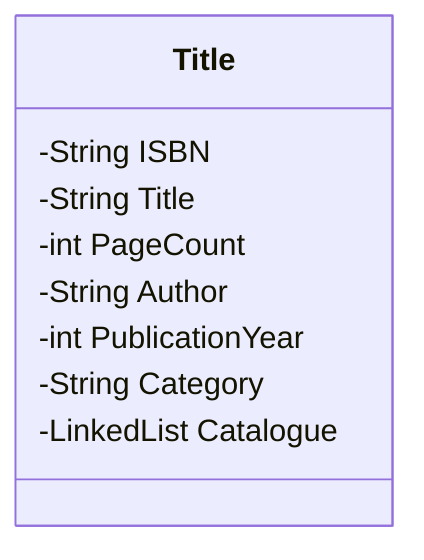
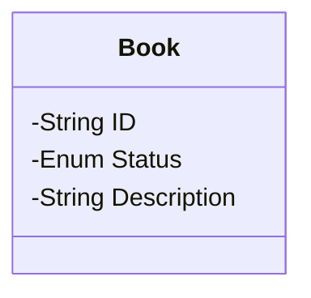
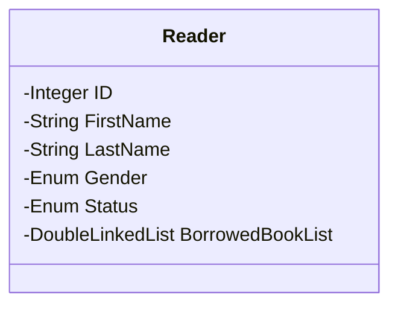
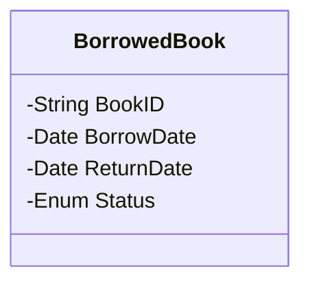

# Library Management Tool

> *This is a final term project for my Data structures and Algorithms class and was instructed by Mr Luu Nguyen Ki Thu.*

---

<!-- @import "[TOC]" {cmd="toc" depthFrom=1 depthTo=6 orderedList=false} -->

<!-- code_chunk_output -->

- [Library Management Tool](#library-management-tool)
  - [Project description](#project-description)
  - [Program functionality](#program-functionality)
  - [Review and evaluation](#review-and-evaluation)
  - [Used tech](#used-tech)
  - [Future update](#future-update)
  - [Usage](#usage)

<!-- /code_chunk_output -->

---

## Project description

Design a program for managing the library which contains these lists:

1. `Title list` is a linear list of `Title`, with each element of the list is a pointer points to a `Title` object (an instance of class `Title`).

    - By default, the list is sorted by the title's name.
    - Each title has a unique ISBN code with $4$ capitalized Alphabet character.

2. `Catalogue` (or book list) is a linked list, with each element of the list is a `Book` object.

    - Each `Book` has a unique ID with the format: `{ISBN}-{Book number}`
    - Each `Book` has $3$ status:

        1. `AVAILABLE`: reader can borrow the book.
        2. `UNAVAILABLE`: reader cannot borrow the book.
        3. `SOLD`: sold, reader cannot borrow the book.

    - The `Book` description will describes the book's position in the library so that the librarian know where the book is. The description follows the format: `ROW {X} COLUMN {Y} SECTION {Z}`.

3. `Reader list` is an AVL Tree, with each node contains a `Reader` object. By default, the reader list is sorted by ID due to the effect of the AVL Tree data structure used to contain the list.

    - Each `Reader` has an unique ID which is a unique automatically random-generated integer.
    - Each `Reader` has $2$ status:

        1. `ACTIVE`: the reader is allowed to borrow books.
        2. `BANNED`: the reader is not allowed to borrow books.

    - Each `Reader` gender is either `MALE` or `FEMALE`.

4. `BorrowedBookList` is a double linked list of `BorrowedBook` object.

    - Each `BorrowedBook` has $3$ status:

        1. `BORROWING`: the book is currently borrowed by this reader.
        2. `RETURNED`: the book used to be borrowed by this reader and now has been returned.
        3. `LOST`: the book used to be borrowed by this reader and now the reader has lost the book.

## Program functionality

1. Apply these operation to the `Reader` object: Create new `Reader`, Update a `Reader` infomation and Delete a `Reader` in the reader list.

2. Print the reader list. By default the list will be sorted by ID. In addition to that, add a functionality to sort the list by the reader's first name then last name.

3. Apply these operation to the `Title` object: Create new `Title`, Update a `Title` infomation and Delete a `Title` in the title list. After creating a new `Title`, the librarian will add a bunch of books to the library, therefore add a functionality to create a list of `Book` object. The `Book` object's ID is auto generated. Also apply the Create/Update/Delete functionality to each `Book` object of the catalogue of each `Title` object. The librarian can delete a `Book` object if and only if that book has not been borrowed by any reader.

4. Print the title list. By default the list will be sorted by title. Add the functionality to sort the list by category, and in each category sorted by title.

5. Searching `Title` functionality by title, ISBN, category, author, publication year, status.

6. Borrow `Book` functionality: the reader will given the `Book` object's ID they want to borrow. The program should be able to detect if the reader has the ability to borrow the book or not. A reader cannot borrow a book if the violate one of these rules:

    1. The reader borrowed more than $3$ books.
    2. The reader borrowed a book more than 7 days. After the 7-th day from the borrow day, every book the reader has borrowed will be an overdue book.
    3. The reader want to borrow a book which belong to the same `Title` of a borrowed book.

7. Return book functionality.

8. Print the list of currently borrowing and borrowed book of a specific reader.

9. Create a table of reader who has an overdue book in their borrowed book list. The table should display the overdue day count in descending order and base on the below table:

| Reader's ID | First name | Last name | Title | Borrow date | Overdue date count |
| :---------: | :--------- | :-------- | :---: | :---------: | :----------------: |
|     ...     | ...        | ...       |  ...  |     ...     |        ...         |

10. Show the top 10 most borrowed title.

## Review and evaluation

The final product was preview and tested by Mr Thu on the Friday, June 16 2023. Sadly he did not tested all the functionality and left some comments:

- Good UI experience. He mentioned that the searching functionality is easy to use and the design is simple.
- Unoptimized design on the program infrastructures and code base.
- Existance of some unneeded feature such as the ranking in the top 10 most borrowed title and some core algorithms I added myself.

The code base is made by me and the database was contributed by Ngan. Therefore I got myself some personal evaluations:

- The UI is kind of old fashion and rough, due to the usage of the framework I had used and lack of personal UI design experience.
- Missing some of the handy functionality such as the functionality for displaying notification window or table related features.
- Lacking of a error catching system.
- The mixed code base design is a huge draw back when the program code base started to scale up and more and more functionality get added to the program.
- Lacking of consistency in naming convension and program design.

Overall from my personal view, I will give myself a solid 7 due to the first time from A-Z project without any instructions and helping from teammates.

## Used tech

- Programming language: `C++20`
- Framework: `Graphic.h` - a combination of `Winbase.h` header and some other header. Here is a link to the [BGI Documentation](https://home.cs.colorado.edu/~main/bgi/doc/) and the Microsoft [`Winbase` header](https://learn.microsoft.com/en-us/windows/win32/api/winbase/).
- OOP technique.

## Future update

Base on the passed experience with the developing process, I will create an updated version of the code using a better solution for the encountered problems.

## Usage

- This app is developed using Visual Studio 2022. Therefore I suggested you to use that to complie and run the app.
- Run the `LibraryManagementTool.sln` file using Visual Studio.
- Then change the solution platform to `x86` then you can run the app.

**Note that there is a bug due to the memory leak so the app can crash suddenly!**
